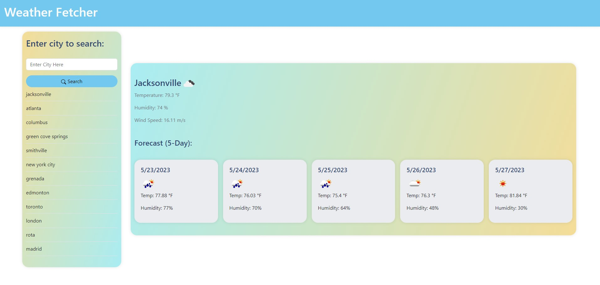

# Weather Fetcher

## Description
Weather Fetcher is a simple, user-friendly web application that provides real-time weather data for any city in the world. It uses the OpenWeatherMap API to fetch current weather data as well as a five-day forecast. It is built with HTML, CSS, and JavaScript, and uses Bootstrap for responsive design.

## Deployed URL

You can view and use this app via this link:  https://dereksutton.github.io/weather-fetcher/

## Features

- Search and view the current temperature, wind speed, and humidity for any given city.
- View a 5-day forecast for the searched city, including the temperature and humidity for each day.
- Keep track of previously searched cities. The application stores your search history in your browser's local storage, and you can click on a city in your history to view its weather data again.

## Installation

No installation necessary - simply navigate to the website in your preferred web browser to begin using the app.

## Usage

1. Enter a city name into the search box and click the `Search` button.
2. The current weather for your chosen city will be displayed on the right side of the screen.
3. Just below the current weather, you'll find a five-day weather forecast for the city you searched.
4. Your search history is displayed on the left under the search input/button. Click on any city in your search history to view its weather data again.

## Credits

This application was built by [github/dereksutton](https://github.com/dereksutton). Project instructions provided by Georgia Tech Coding Bootcamp. The app uses [Bootstrap](https://getbootstrap.com/) for the front-end framework, and [Day.js](https://day.js.org/) for the date formatting. The weather data is provided by a third-party API from [OpenWeatherMap](https://openweathermap.org/).

## License

[MIT](https://opensource.org/licenses/MIT)

## Contact

Built by [github/dereksutton](https://github.com/dereksutton). You can email me [here](mailto:dereksutton86@gmail.com).